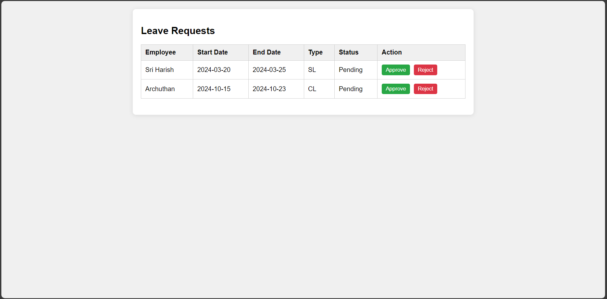
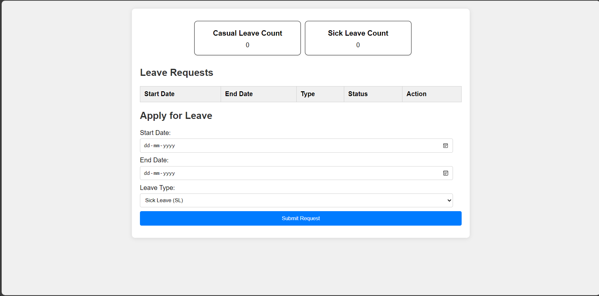
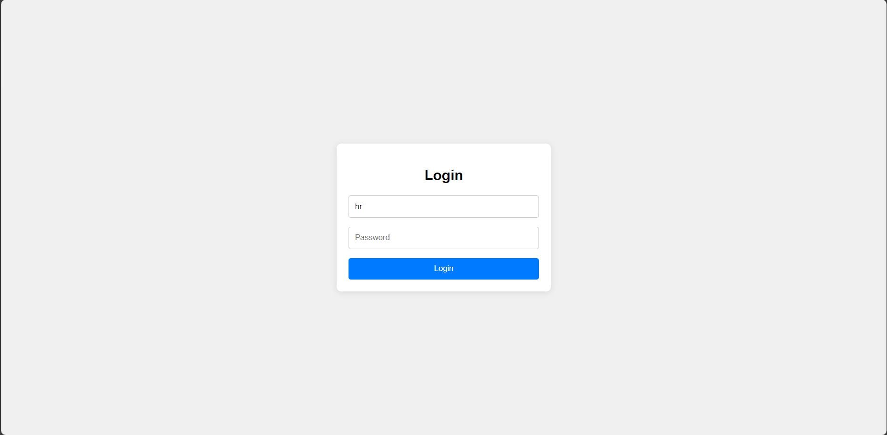

# Leave Management frontend

## Overview
Leave Management serves as a user interface for the employees to request for leave and HRs to approve or reject the leave requested by the employee

## Features

### HR Dashboard

- View leaves requested by the employees
- Manage leave requests by approve/reject them
### Employee Dashboard

- View leaves requested by them
- Request for leave
- Cancel any requested leave
- View the sick and casual leave count
### Login

- role based login based on username and password
## UI Components used
Leave Management uses user interface componenets like forms, buttons, tables

## Technologies used
1. HTML
2. CSS
3. Javascript
## Usage
- locate the login.html file and open the file to run the frontend
## Deployment
You can access the website using the following link https://archuthan23.github.io/Leave-Management-Frontend/
